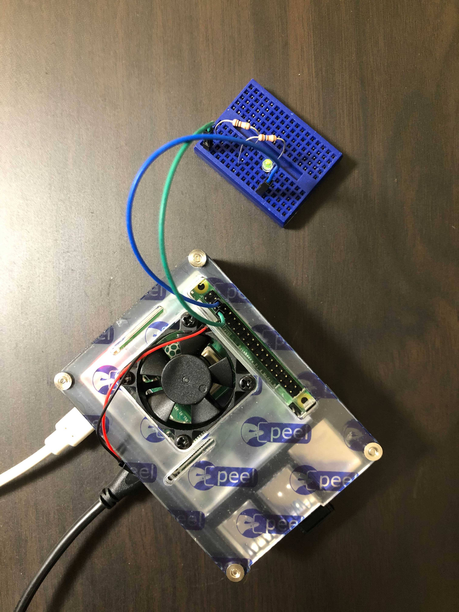
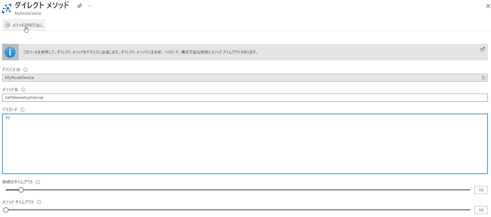
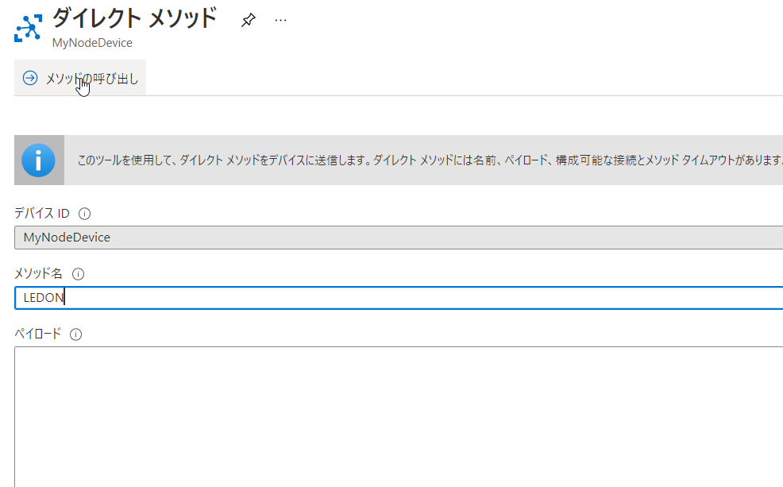
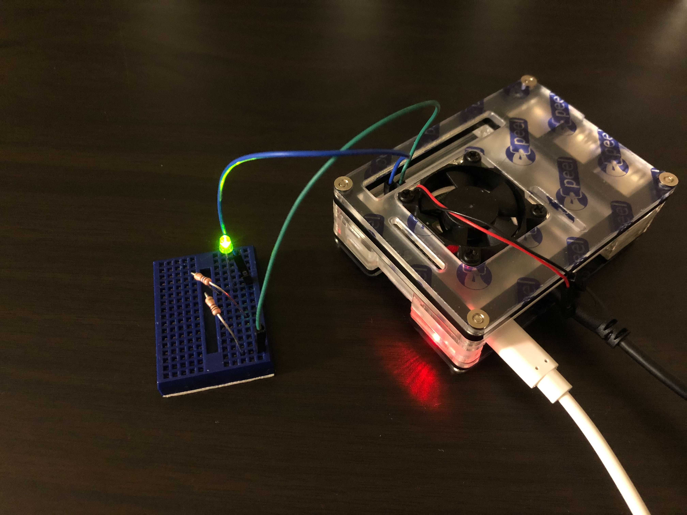
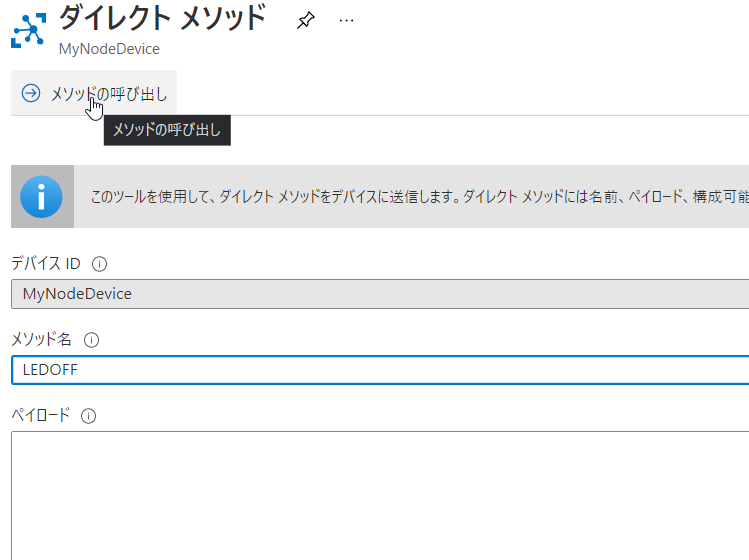
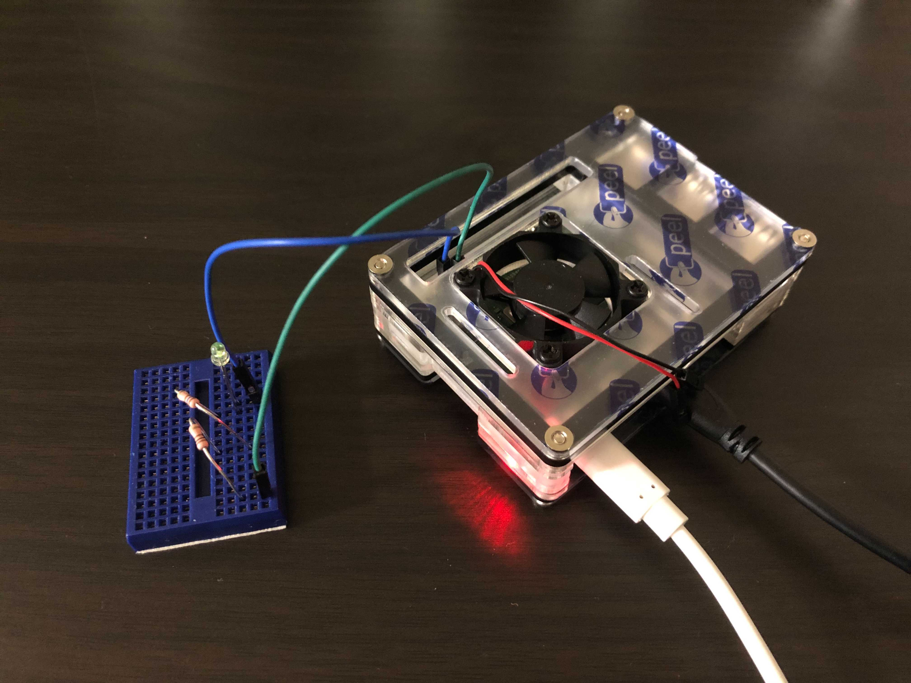

# Azure IoT Hub × Raspberry pi でリモートLピカ

## はじめに
今回は、Azure IoT Hub のダイレクトメソッドを使って、LEDライトを操作してみます。  
[ダイレクトメソッド](https://docs.microsoft.com/ja-jp/azure/iot-hub/iot-hub-devguide-direct-methods) とは、クラウドからデバイス上に実装されているメソッドを呼び出す機能です。
今回は、Raspberry Pi 上で Node.js のアプリを実行し、GPIO の制御によってLEDライトをオン／オフします。

具体的には、Azure Portal から __LEDON__ というダイレクトメソッドを実行することで、 Raspberry Pi に接続しているLEDライトが点灯し、 __LEDOFF__ というダイレクトメソッドでLEDライトが消えるようにします。

<br />

## 用意するもの

* Raspberry Pi 4 Model B
* Azure サブスクリプション
* 電子工作キット
    * ブレッドボード
    * ブレッドボード用ジャンパー線（オスーメス）×２
    * LEDライト
    * 抵抗

抵抗については、使用するLEDライトをもとに計算してください。ぼくは緑色のLEDライトと 300 Ω くらいの抵抗を使っています。  
抵抗値の計算で参考にしたWebサイト： [マイコンで赤いLEDを光らせるには抵抗が必要なんです](https://kohacraft.com/archives/1048111647.html)

<br />

## 手順概要

1. Azure IoT Hub を作成する
2. Node.js アプリを作成する
3. Raspberry Pi をセットアップする
4. Raspberry Pi 上で Node.js アプリを実行する
5. ダイレクトメソッドを使ってLEDライトをオンオフする

## 手順詳細

各手順について説明します。

### 1. Azure IoT Hub を作成する
Azure Portal から Azure IoT Hub を作成する。

ダイレクトメソッドを利用するため、 Free または Standard プランで作成する。Standard 3 は料金がめちゃくちゃ高いので注意。

実際の手順は、MS公式ドキュメント [クイック スタート:Node.js を使用して、Azure IoT ハブに接続されたデバイスを制御する](https://docs.microsoft.com/ja-jp/azure/iot-hub/quickstart-control-device-node) をご参照ください。

[IoT Hub の作成](https://docs.microsoft.com/ja-jp/azure/iot-hub/quickstart-control-device-node#create-an-iot-hub) と [デバイスの登録](https://docs.microsoft.com/ja-jp/azure/iot-hub/quickstart-control-device-node#register-a-device) を実施し、登録したデバイスの __"デバイス接続文字列"__ をメモしておきます。

```sh
az iot hub list
YourIoTHubName={Your IoT Hub name here}

# デバイスの作成
az iot hub device-identity create --hub-name $YourIoTHubName --device-id MyNodeDevice

# デバイス接続文字列の取得
az iot hub device-identity connection-string show --hub-name $YourIoTHubName --device-id MyNodeDevice --output table
```

<br />

#### 2. Node.js アプリを作成する

公式ドキュメント内でも案内されている、 [サンプル Node.js プロジェクト](https://github.com/Azure-Samples/azure-iot-samples-node/) をもとに、今回のアプリを作成します。

使うものは、 https://github.com/Azure-Samples/azure-iot-samples-node/tree/master/iot-hub/Quickstarts/simulated-device-2 内の [SimulatedDevice.js](https://github.com/Azure-Samples/azure-iot-samples-node/blob/master/iot-hub/Quickstarts/simulated-device-2/SimulatedDevice.js) と [package.json](https://github.com/Azure-Samples/azure-iot-samples-node/blob/master/iot-hub/Quickstarts/simulated-device-2/package.json) です。  
__package.json__  は変更しませんが、後で使うので作業端末にダウンロードしておいてください。

試しにそのままクイックスタートを進めていくと、 __SetTelemetryInterval__ という名前のメソッドがダイレクトメソッドで呼び出されることがわかります。  
__SimulatedDevice.js__ の中で該当の箇所を参考にし、LEDON と LEDOFF の機能を追加していきます。まずは __SimulatedDevice.js__ の中身を確認します。

```js:抜粋_SimulatedDevice.js
// Function to handle the SetTelemetryInterval direct method call from IoT hub
function onSetTelemetryInterval(request, response) {
  // Function to send a direct method reponse to your IoT hub.
  function directMethodResponse(err) {
    if(err) {
      console.error(chalk.red('An error ocurred when sending a method response:\n' + err.toString()));
    } else {
        console.log(chalk.green('Response to method \'' + request.methodName + '\' sent successfully.' ));
    }
  }

  console.log(chalk.green('Direct method payload received:'));
  console.log(chalk.green(request.payload));

  // Check that a numeric value was passed as a parameter
  if (isNaN(request.payload)) {
    console.log(chalk.red('Invalid interval response received in payload'));
    // Report failure back to your hub.
    response.send(400, 'Invalid direct method parameter: ' + request.payload, directMethodResponse);

  } else {

    // Reset the interval timer
    clearInterval(intervalLoop);
    intervalLoop = setInterval(sendMessage, request.payload * 1000);

    // Report success back to your hub.
    response.send(200, 'Telemetry interval set: ' + request.payload, directMethodResponse);
  }
}

// Set up the handler for the SetTelemetryInterval direct method call.
client.onDeviceMethod('SetTelemetryInterval', onSetTelemetryInterval);
```

```client.onDeviceMethod('SetTelemetryInterval', onSetTelemetryInterval);``` のように書くことで、__SetTelemetryInterval__ というダイレクトメソッドを呼び出したときに、 __onSetTelemetryInterval__ が実行されるようです。これを参考に __LEDON__ と __LEDOFF__ も追加します。

```js:LEDONとLEDOFFのダイレクトメソッドハンドラーを追加.js
// Set up the handler for the SetTelemetryInterval direct method call.
client.onDeviceMethod('SetTelemetryInterval', onSetTelemetryInterval);
client.onDeviceMethod('LEDON', onLedOn);
client.onDeviceMethod('LEDOFF', onLedOff);
```

次に、LEDを操作する function を追加していきます。 
LEDライトの操作は、Raspberry Pi の [GPIO](https://www.raspberrypi.org/documentation/usage/gpio/) という機能を使って制御します。
詳しくはググってみてください。今回は、 JavaScript の [fs](https://nodejs.org/api/fs.html) モジュールを使い、GPIO のファイルを操作します。__onSetTelemetryInterval__ を参考に __onLedOn__ , __onLedOff__ を追加します。

```js:LED操作用function.js
var fs = require('fs');
var gpiopin = 4; // GPIO4 (ピン7) を使う

function onLedOn(request, response) {
  // Function to send a direct method reponse to your IoT hub.
  function directMethodResponse(err) {
    if(err) {
      console.error(chalk.red('An error ocurred when sending a method response:\n' + err.toString()));
    } else {
        console.log(chalk.green('Response to method \'' + request.methodName + '\' sent successfully.' ));
    }
  }
  // gpio Setting
  if (!fs.existsSync(`/sys/class/gpio/gpio${gpiopin}`)) {
    fs.writeFileSync('/sys/class/gpio/export', gpiopin);
  }
  // LED On
  console.log(chalk.green("LED ON"));
  fs.writeFileSync(`/sys/class/gpio/gpio${gpiopin}/direction`, 'out');
  fs.writeFileSync(`/sys/class/gpio/gpio${gpiopin}/value`, 1);
  response.send(200, 'LED ON message: ' + request.payload, directMethodResponse);
}

function onLedOff(request, response) {
  // Function to send a direct method reponse to your IoT hub.
  function directMethodResponse(err) {
    if(err) {
      console.error(chalk.red('An error ocurred when sending a method response:\n' + err.toString()));
    } else {
        console.log(chalk.green('Response to method \'' + request.methodName + '\' sent successfully.' ));
    }
  }
  // off
  if (fs.existsSync(`/sys/class/gpio/gpio${gpiopin}`)) {
    fs.writeFileSync(`/sys/class/gpio/gpio${gpiopin}/value`, 0);
    console.log(chalk.green("LED OFF"));
    // gpio 初期化
    fs.writeFileSync('/sys/class/gpio/unexport', gpiopin);
    response.send(200, 'LED OFF message: ' + request.payload, directMethodResponse);
  } else {
    // エラー処理
    console.log(chalk.red('Something wrong in LEDOFF'));
    // Report failure back to your hub.
    response.send(400, 'Invalid direct method parameter: ' + request.payload, directMethodResponse);
  }
}
```

以上を __SimulatedDevice.js__ に追記します。完成したものを以下に置いておきます。  
https://github.com/yukit7s/AzureIoTHub_Lpika/tree/main/iot-hub_LED


最後に、デバイス接続文字列を書き換えます。

```js
// Using the Azure CLI:
// az iot hub device-identity show-connection-string --hub-name {YourIoTHubName} --device-id MyNodeDevice --output table
var connectionString = '{Your device connection string here}';
```

これで __2. Node.js アプリを作成する__ は完了です。

<br />

### 3. Raspberry Pi をセットアップする

ラズパイのセットアップとして、以下を行います。

1. Raspbeery Pi OS のインストール
2. Wi-Fi 接続
3. SSH 接続の許可
4. Node, npm のインストール
5. 作成したアプリの配置と必要なモジュールのインストール
6. LEDライトの接続

1~4 はググったらたくさん出てくるので調べながらやってみてください。

<!-- #### 3-4. Node, npm のインストール
Raspberry Pi にSSH接続し、以下を実行します。

```sh
sudo apt-get update
sudo apt-get install -y nodejs npm
sudo npm cache clean
sudo npm install npm n -g
sudo n stable
``` -->

ここでは __5. 作成したアプリの配置と必要なモジュールのインストール__ から説明します。

#### 3-5. 作成したアプリの配置と必要なモジュールのインストール
Rasppberry Pi に Tera Term などで SSH 接続し、プロジェクト用のディレクトリを作成します。

```console
pi@raspberrypi:~ $ mkdir iot-hub_LED
```

Rasppberry Pi のプロジェクトルートディレクトリに、手順 2 で作成／取得した __SimulatedDevice.js__ と __package.json__ をアップロードします。  

ファイルアップロード後、プロジェクトルートに以下の2ファイルがあることを確認してください。

```console
pi@raspberrypi:~/iot-hub_LED $ ls
SimulatedDevice.js  package.json
```

__package.json__ をもとに、必要なモジュールを取得します。プロジェクトのルートディレクトリで、以下を実行します。
```console
pi@raspberrypi:~/iot-hub_LED $ npm install
```

コマンドが正常に終了し、__node_modules__ のディレクトリができていることを確認します。

```console
pi@raspberrypi:~/iot-hub_LED $ ls
SimulatedDevice.js  node_modules  package-lock.json  package.json
```

以上で、 __3-5. 作成したアプリの配置と必要なモジュールのインストール__ は完了です。


#### 3-6. LEDライトの接続

Raspberry Pi と LEDライトを接続していきます。

> ※ 電子回路なので、間違えると危ないと思います。GPIO をよく理解してから回路を作っていくことをおすすめします。

__SimulatedDevice.js__ 内に追記したように、今回は GPIO4(ピン7) を操作します。適当な GND と GPIO4 の間に、抵抗と LED ライトが挟まるように直列に回路をつなぎます。



上の図では、 [ピン7(GPIO4)] -- [抵抗] -- [LEDライト] -- [ピン6(GND)] とつないでいます。
※回路がショートすると危険なので、抵抗器の針金は短く切ったほうが良いと思います。

ここまでで、 __3. Raspberry Pi をセットアップする__ も完了です。

<br />

### 4. Raspberry Pi 上で Node.js アプリを実行する

それではいよいよアプリを動かしていきます。  
Raspbeery Pi に SSH 接続し、プロジェクトルートディレクトリで __SimulatedDevice.js__ を実行します。 GPIO関連 のファイルを操作するときに強い権限が必要なため、 sudo で実行します。

```console:
pi@raspberrypi:~/iot-hub_LED $ sudo node SimulatedDevice.js
Sending message: {"temperature":31.89108235796964,"humidity":77.88796317168611}
message sent
Sending message: {"temperature":24.975233115046237,"humidity":73.68089023305838}
message sent
```

もともとの __SimulatedDevice.js__ の機能により、1秒ごとにダミーのテレメトリを送信しています。

また、このアプリには __SetTelemetryInterval__ というダイレクトメソッドが用意されていたので、試しに実行してみましょう。

Azure Portal にログインし、IoT Hub を開きます。[IoT デバイス] から __MyNodeDevice__ (※自分で作成したデバイス名) を選択し、[ダイレクト メソッド] をクリックします。

[メソッド名] に __SetTelemetryInterval__ 、[ペイロード] に __10__ を入れて実行します。



Raspberry Pi 側のコンソールに以下のような出力があり、テレメトリ送信の間隔が10秒間隔になっていると思います。

```console
Direct method payload received:
10
Response to method 'SetTelemetryInterval' sent successfully.
```

ペイロードを __3__ にして __SetTelemetryInterval__ を実行すると、テレメトリ送信の間隔が3秒間隔になります。具体的な処理は、 __SimulatedDevice.js__ 内の ```function onSetTelemetryInterval(request, response)``` を見てみてください。

このように、ダイレクトメソッドを実行することで、Raspberry Pi 上のアプリの function を呼び出すことができます。

<br />

### 5. ダイレクトメソッドを使ってLEDライトをオンオフする
ダイレクトメソッドを使ってLEDライトを操作します。  
__SetTelemetryInterval__ と同じ要領で、Azure Portal から __LEDON__ を実行します。ペイロードの値は入れても入れなくても良いです。



ダイレクトメソッドを実行すると、LEDライトが点灯します。



<br />

同様に __LEDOFF__ を実行します。



LEDライトが消えました。




<br />

## おわりに 
今回は、Azure IoT Hub のダイレクトメソッドを使って、LEDライトのON/OFFを制御してみました。この機能を使えば、ペットのえさやりなどいろいろなことに応用出来そうですね。

Azure IoT Hub の Standard プランの場合、月額 2000 円/デバイス･月 くらい～かかるので、不要になったリソースは削除しておきましょう。

<br />

## 参考
1. クイック スタート:Node.js を使用して、Azure IoT ハブに接続されたデバイスを制御する  
https://docs.microsoft.com/ja-jp/azure/iot-hub/quickstart-control-device-node

1. 第9回「ラズベリーパイで電子工作！Lチカ…の前にLピカ！」  
https://deviceplus.jp/hobby/raspberrypi_entry_009/

1. GPIO  
https://www.raspberrypi.org/documentation/usage/gpio/